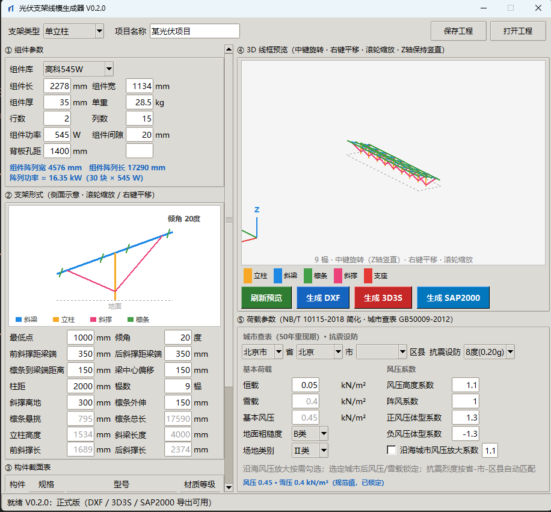

# 光伏支架线模生成器（PV Support Line Model Generator）

用 Python（tkinter）开发的光伏支架参数化建模辅助工具：通过图形界面输入组件、支架形式、构件截面、荷载等参数，实时预览支架线模，并导出 DXF / 3D3S / SAP2000 供结构计算软件使用。



## 当前状态

- **版本**：V0.2.0（首个正式版，2026-08-13）
- 三路导出全部可用：DXF 线模 / 3D3S 文本模型（含 Excel 备用）/ SAP2000 .s2k
- 工程参数可保存 / 打开为 JSON

## 功能

### ① 组件参数
- 组件库选择（高科545W / 正泰550W / 锦州阳光545W / 自定义）
- 组件长宽厚、单重、行数、列数、功率、间隙、背板孔距
- 自动计算：组件阵列宽/长、阵列功率

### ② 支架形式
- 侧面示意图（滚轮缩放 / 右键平移）
- 最低点、倾角、前后斜撑距梁端、端距、梁中心偏移、柱距、榀数
- 斜撑离地、檩条外伸
- 自动计算：檩条悬挑、檩条总长、立柱高度、斜梁长度、前/后斜撑长

### ③ 构件截面表
- 立柱 / 斜梁 / 檩条 / 斜撑 / 檩托 / 抱箍 / 横担
- 规格类型（C型钢 / Z型钢 / U型钢 / 槽钢 / 角钢 / 圆钢圆管 / 方钢管 / 矩形钢管）
- 型号与材质等级（Q235B / Q355B / Q460B / 铝型材）
- 内置 3D3S 真实截面库（381 个型号）

### ④ 3D 线框预览
- 按榀数生成多榀三维线框
- 中键旋转（Z 轴保持竖直）、右键平移、滚轮缩放
- 构件分色显示（立柱/斜梁/檩条/斜撑/支座）

### ⑤ 荷载参数
- 城市查表（GB50009-2012 附录 E，50 年重现期基本风压/雪压，34 省级、668 城市）
- 抗震设防按省-市-区县自动匹配
- 恒载、雪载、基本风压、地面粗糙度、场地类别
- 风压高度系数、阵风系数、正/负风压体型系数
- 沿海城市风压放大系数（按需勾选）

## 导出

| 目标 | 格式 | 说明 |
|---|---|---|
| DXF | `.dxf` | 线模 + 构件分组图层 + 截面信息文字表 |
| 3D3S | `.3D3S` / `.xlsx` | 文本模型（含方位角/K节点）或 Excel 导入 |
| SAP2000 | `.s2k` | 材料/截面/荷载/组合/分组，0 错误导入 |

## 运行

```bash
python pv_support_gui.py
```

要求：Python 3.10+（自带 tkinter）；DXF 导出需要 `ezdxf`（无则自动降级为手写 DXF）。

## 文件说明

| 文件 | 说明 |
|---|---|
| `pv_support_gui.py` | 主程序（V0.2.0 正式版） |
| `pv_geometry.py` | 几何引擎（节点/杆件/尺寸计算） |
| `pv_sections.py` / `pv_3d3s_sections.py` / `pv_3d3s_lib.py` | 截面库与 3D3S 真实截面数据 |
| `pv_3d3s_text.py` / `pv_excel.py` | 3D3S 文本 / Excel 导出 |
| `pv_s2k.py` | SAP2000 .s2k 导出 |
| `需求文档.md` | 版本需求记录（V1.2.0 ~ V0.2.0） |
| `光伏支架线模生成器_MVP技术方案.md` | MVP 技术方案 |
| `光伏支架工程示例.json` | 默认工程参数模板 |
| `荷载规范城市数据.json` | GB50009-2012 附录 E.5 城市风压/雪压（50 年重现期） |
| `抗震设防数据.json` | 省-市-区县抗震设防烈度 |
| `界面预览_V0.2.0.png` | 软件界面截图 |

## 数据来源说明

`荷载规范城市数据.json` 取自《建筑结构荷载规范》GB50009-2012 附录 E.5 全国各城市雪压、风压值表（联网核对版）。光伏支架计算取 50 年重现期值（w50/s50）；个别冷门站点数值建议与正式规范文本复核。

`抗震设防数据.json` 按现行《建筑抗震设计规范》GB50011-2010 及各地抗震设防区划整理，供界面自动匹配参考；正式项目请以工程所在地政府批复文件为准。

## 后续计划

- 截面库补全与自定义截面
- 荷载组合输出细化（NB/T 10115-2018）
- 打包免安装 exe
