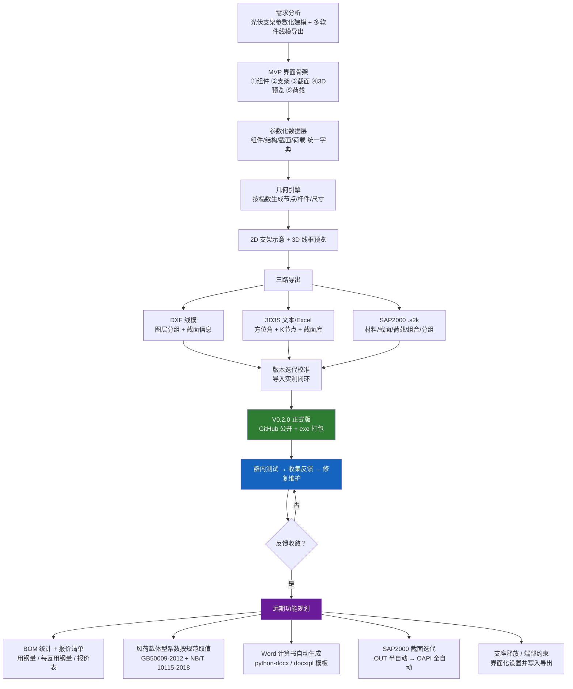

# 光伏支架线模生成器 — 软件开发流程图

> Obsidian 中可直接渲染本 Mermaid 图（代码块语言 `mermaid`）。
> 版本：V0.2.0（2026-08-13，首个正式版）

## 说明

- **当前阶段**：V0.2.0 已发布，进入 `群内测试 → 反馈 → 修复维护` 循环；
- **开发原则**：先维护稳定、不急于加新功能；反馈收敛后再按 P1~P4 优先级推进；
- **远期功能**：BOM/报价（P1）→ 体型系数自动取值（P2）→ Word 计算书（P3）→
  SAP2000 截面迭代与支座释放（P4）。

配套任务清单详见《需求文档.md》第七章"后续开发规划（任务书）"。
